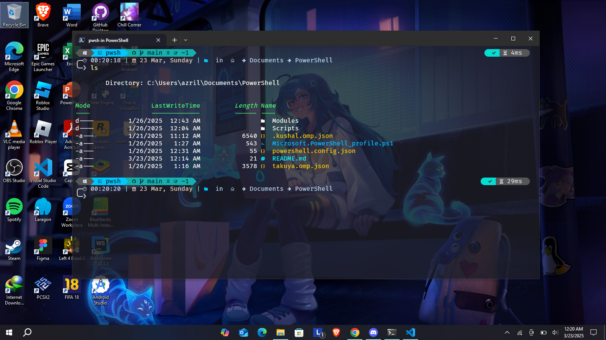

# PowerShell Config

My personal PowerShell configuration — including dotfiles, modules, themes, and additional setups to make the shell experience more comfortable and productive.

## Features

- Custom PowerShell profile (`Microsoft.PowerShell_profile.ps1`) for aliases, functions, and other tweaks  
- Additional modules in the `Modules/` folder  
- Themes / prompt / extra configuration through JSON files (`powershell.config.json`, `takuya.omp.json`, etc.)  
- `images/` folder for screenshots or visual references  

## Repository Structure

```
├── Modules/                 # Additional PowerShell modules
├── images/                  # Screenshots / visual references
├── Microsoft.PowerShell_profile.ps1  # Main PowerShell profile
├── powershell.config.json   # Main configuration file (theme, prompt, etc.)
├── takuya.omp.json          # Extra / alternative prompt configuration
└── README.md                # This documentation
```

## Requirements

- Windows / macOS / Linux with a recent version of PowerShell  
- Access to required modules (install via PowerShell Gallery or local modules if missing)  
- Permission to run PowerShell scripts (Execution Policy)  

## Installation & Setup

1. Clone this repository:
   ```bash
   git clone https://github.com/itsmeowdev/powershell-config.git
   cd powershell-config
   ```

2. Copy or symlink the profile file to your PowerShell profile path:
   - Windows:
     ```powershell
     cp Microsoft.PowerShell_profile.ps1 $HOME\Documents\PowerShell\Microsoft.PowerShell_profile.ps1
     ```
   - macOS/Linux:
     ```bash
     cp Microsoft.PowerShell_profile.ps1 ~/.config/powershell/Microsoft.PowerShell_profile.ps1
     ```

3. Make sure the configuration files (`powershell.config.json`, `takuya.omp.json`) are located where referenced in your profile, or adjust the path accordingly.

4. Install the modules from the `Modules` folder if not already available:
   ```powershell
   Import-Module ./Modules/ModuleName
   ```
   Or from PowerShell Gallery:
   ```powershell
   Install-Module ModuleName -Scope CurrentUser
   ```

5. Reload your PowerShell profile:
   ```powershell
   . $PROFILE
   ```

## Additional Setup

- If you are using a prompt/theme engine (like Oh My Posh), ensure it is installed and that the JSON themes included here match your version.  
- Adjust your Execution Policy if you run into script execution errors:
  ```powershell
  Set-ExecutionPolicy RemoteSigned -Scope CurrentUser
  ```

## Screenshots

Here’s a preview of the PowerShell configuration in action:



## All Available Modules / Tools

These are the main modules and tools used in this configuration:

- [Oh My Posh](https://ohmyposh.dev) — A prompt theme engine for PowerShell  
- [PSReadLine](https://github.com/PowerShell/PSReadLine) — Command-line editing, syntax highlighting, history  
- [posh-git](https://github.com/dahlbyk/posh-git) — Git status summary information in prompt  
- [z](https://github.com/agkozak/zsh-z) — Directory jumper (`Modules/z/`)  
- [PowerShell Gallery](https://www.powershellgallery.com/) — Source for installing extra modules  

*(You can expand this list with more tools/modules as you add them to the repository.)*

## Contributing

Contributions are welcome! You can help by:  
- Opening issues for bugs or suggestions  
- Submitting pull requests with improvements, modules, or themes  
- Expanding the documentation for clarity  

## License

Specify your license here (e.g., MIT, Apache, etc.) so that others know how they can use your configuration.


---

# Extended Documentation

## Table of Contents
- [Quick Start](#quick-start)
- [App Launcher: Overview](#app-launcher-overview)
- [Commands & Examples](#commands--examples)
- [Aliases & Autocomplete](#aliases--autocomplete)
- [Bulk Register Built‑in Windows Apps](#bulk-register-built-in-windows-apps)
- [Keyboard Shortcuts (Profile)](#keyboard-shortcuts-profile)
- [Troubleshooting](#troubleshooting)
- [FAQ](#faq)
- [Where is my PowerShell profile?](#where-is-my-powershell-profile)
- [Uninstall / Revert](#uninstall--revert)

## Quick Start
1. Copy the profile to your `$PROFILE` path (see *Where is my PowerShell profile?* below).
2. Reload PowerShell:
   ```powershell
   . $PROFILE
   ```
3. List registered apps:
   ```powershell
   apps
   ```
4. Open an app:
   ```powershell
   open vscode
   ```

## App Launcher: Overview
This repo ships a lightweight “app launcher” that lets you open programs with short names and manage them persistently via your PowerShell profile.

Behind the scenes, a hashtable `$global:apps` stores the mappings **name → target** (either a full path to an `.exe`, a shell command like `notepad`/`calc`, a `shell:AppsFolder\\<AppUserModelID>`, or a URI like `ms-windows-store:`). The helper `Save-AppsToProfile` keeps this table synced to your profile so changes survive restarts.

## Commands & Examples

### Register / Update / Remove
```powershell
# register a new app mapping
register-app "vscode" "C:\Users\<you>\AppData\Local\Programs\Microsoft VS Code\Code.exe"

# update an existing mapping
update-app   "vscode" "D:\Apps\VSCode\Code.exe"

# remove a mapping
remove-app   "vscode"
```

**Validation flags**
- `-Force` — save even if the target is not found (useful for UWP protocols or when pre‑staging paths).
- `-DryRun` — preview the change without writing your profile.

Examples:
```powershell
register-app "store" "ms-windows-store:" -Force
update-app   "vscode" "Z:\Later\Code.exe" -Force -DryRun
```

### Open and List
```powershell
open vscode       # launches the app mapped as 'vscode'
apps              # list all apps
apps code         # list apps that match 'code'
```

### Integrated Help
```powershell
open --help
```

## Aliases & Autocomplete
- **Aliases:** `o` → `open`, `regapp` → `register-app`, `updapp` → `update-app`, `rmapp` → `remove-app`, `apps`/`la` → `list-apps`.
- **Autocomplete:** fuzzy completion is available for `open`, `updapp`, `rmapp`, and for the `apps` filter argument. Press **Tab** to cycle suggestions. Matching prioritizes **prefix**, then **substring**, then **subsequence** (e.g., `vs` suggests `vscode`).

## Bulk Register Built‑in Windows Apps
You can quickly register common Windows built‑ins (Store, Settings, Photos, Mail, etc.). Run this one‑off script after your profile is loaded:

```powershell
# Preview (no changes written)
.\register-windows-apps.ps1 -DryRun

# Apply (skip existing entries)
.\register-windows-apps.ps1

# Overwrite existing entries
.\register-windows-apps.ps1 -UpdateExisting
```

> Tip: You can also manually register UWP targets with URI or `shell:AppsFolder`:
> ```powershell
> regapp "store"    "ms-windows-store:"  -Force
> regapp "settings" "ms-settings:"       -Force
> regapp "photos"   "shell:AppsFolder\\Microsoft.Windows.Photos_8wekyb3d8bbwe!App" -Force
> ```

## Keyboard Shortcuts (Profile)
Your profile config includes:
- **PSReadLine**
  - *Edit mode:* Emacs
  - **Ctrl+D** — delete char
  - *Prediction:* from history (ListView)
- **PSFzf**
  - **Ctrl+F** — provider launcher
  - **Ctrl+R** — reverse search history

## Troubleshooting
- **Script blocked by policy**
  ```powershell
  Set-ExecutionPolicy RemoteSigned -Scope CurrentUser
  ```
- **Path not launching**
  - Try the full path first; if it works manually, `register-app` the same path.
  - For UWP apps or settings pages, use `ms-*:` URIs or `shell:AppsFolder\\<AppUserModelID>` and add `-Force`.
- **Profile didn’t save your change**
  - Ensure there’s only **one** auto‑generated block in your profile (it’s rewritten by `Save-AppsToProfile`).
  - Reload:
    ```powershell
    . $PROFILE
    ```
- **Autocomplete not working**
  - Verify that the functions are loaded (`Get-Command open`).
  - Check that `Register-ArgumentCompleter` calls are present in your profile.

## FAQ
**Q:** Can I map folders to open in Explorer?  
**A:** Yes — point to `explorer.exe`, or use a URI:
```powershell
regapp "projects" "explorer.exe D:\Projects"
regapp "downloads" "explorer.exe shell:Downloads"
```

**Q:** Do I need quotes around paths?  
**A:** Quote paths that contain spaces, e.g., `"C:\Program Files\App\app.exe"`.

**Q:** Does this work on non‑Windows?  
**A:** Most features do. Windows‑specific examples (Explorer, Store, `shell:` URIs) won’t apply on macOS/Linux.

## Where is my PowerShell profile?
Show the resolved path:
```powershell
$PROFILE
```
Typical locations:
- **Windows:** `%USERPROFILE%\Documents\PowerShell\Microsoft.PowerShell_profile.ps1`
- **macOS/Linux:** `~/.config/powershell/Microsoft.PowerShell_profile.ps1`

## Uninstall / Revert
- Remove the functions/aliases from your profile, or restore a previous version.
- Delete the auto‑generated `$global:apps` block at the end of the profile.
- Reload PowerShell:
  ```powershell
  . $PROFILE
  ```
